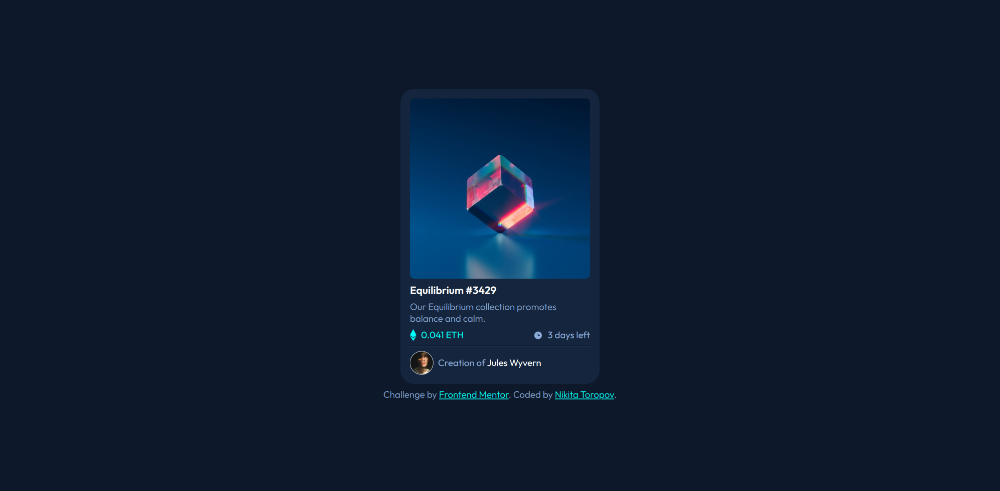

# Frontend Mentor - NFT preview card component solution

This is a solution to the [NFT preview card component challenge on Frontend Mentor](https://www.frontendmentor.io/challenges/nft-preview-card-component-SbdUL_w0U). 

## Table of contents

- [Overview](#overview)
  - [The challenge](#the-challenge)
  - [Screenshot](#screenshot)
  - [Links](#links)
- [Built with](#built-with)
- [Author](#author)

## Overview

### The challenge

Users should be able to:

- View the optimal layout depending on their device's screen size
- See hover states for interactive elements

### Screenshot

### Links

- Solution URL: [https://github.com/tossik8/nft-preview-card-component](https://github.com/tossik8/nft-preview-card-component)
- Live Site URL: [https://jolly-starlight-bcb938.netlify.app/](https://jolly-starlight-bcb938.netlify.app/)

## Built with

- Semantic HTML5 markup
- CUBE CSS
- Flexbox
- Google Fonts

## Author

- LinkedIn - [Nikita Toropov](https://www.linkedin.com/in/nikita-toropov/)
- Frontend Mentor - [@tossik8](https://www.frontendmentor.io/profile/tossik8)
